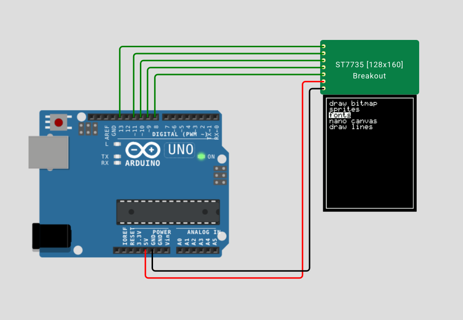

# ST7735 Chip 
Simulation chip for [Wokwi](https://wokwi.com/)

## Pin names

| Name | Description              |
| ---- | ------------------------ |
| SCK  | SPI Clock                |
| MOSI | Data IN                  |
| CS   | Chip Select              |
| DS   | DS                       |
| RST  | Reset                    |
| VCC  | VCC                      |
| GND  | Supply voltage           |

## Usage

Tested with 128x160x16_SPI.

To use this chip in your project, include it as a dependency in your `diagram.json` file:

```json
  "dependencies": {
    "st7735": "github:martysweet/st7735-wokwi-chip@1.0.0"
  }
```

Then, add the chip to your circuit by adding a `st7735` item to the `parts` section of diagram.json:

```json
  "parts": {
    ...,
    { "type": "chip-st7735", "id": "display" }
  },
```

## Screenshot


# Development

The actual source code for the chip lives in [src/main.c](src/main.c), and the pins are described in [chip.json](chip.json).

## Building

The easiest way to build the project is to open it inside a Visual Studio Code dev container, and then run the `make` command.

## Testing

You can test this project using the [Wokwi extension for VS Code](https://marketplace.visualstudio.com/items?itemName=wokwi.wokwi-vscode). Open the project with Visual Studio Code, press "F1" and select "Wokwi: Start Simulator".

If you want to make changes to the test project firmware, edit [test/blink/blink.ino](test/blink/blink.ino), and then run `make test` to rebuild the .hex file. You'll need the [arduino-cli](https://arduino.github.io/arduino-cli/latest/installation/), which is already installed in the dev container.

## License

This project is licensed under the MIT license. See the [LICENSE](LICENSE) file for more details.
